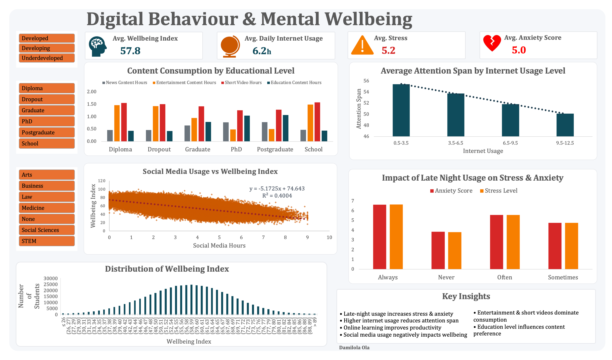

# 📊 Digital Behaviour & Mental Wellbeing Analysis

## 📌 Overview

This project analyzes the relationship between digital behaviour and mental wellbeing using an interactive Excel dashboard, uncovering patterns in screen time, attention span, stress, and content consumption.

---
## 📊 Dashboard Preview



## 🎯 Problem Statement

With increasing digital engagement, individuals spend significant time online, but the impact on mental wellbeing is not always clearly understood.

This project explores:

* The effect of screen time on wellbeing
* The relationship between internet usage and attention span
* The impact of late-night usage on stress and anxiety
* Content consumption patterns across different user groups

---

## 📂 Dataset

The dataset includes behavioural and psychological indicators such as:

* Daily internet usage (hours)
* Social media usage
* Wellbeing index
* Stress and anxiety levels
* Attention span
* Content consumption categories
* Demographic variables (education level, field of study)

---

## ⚙️ Methodology

The analysis was conducted using exploratory data analysis (EDA) techniques:

* Data cleaning and transformation
* Pivot table analysis
* Trend and comparative analysis
* Interactive filtering using slicers

---

## 📊 Dashboard Features

* KPI metrics (wellbeing, stress, attention span)
* Social media usage vs wellbeing analysis
* Internet usage vs attention span trends
* Late-night usage impact on mental health
* Content consumption distribution
* Interactive filters for dynamic exploration

---

## 🔍 Key Insights

* Increased social media usage is associated with lower wellbeing
* Higher internet usage correlates with reduced attention span
* Late-night usage significantly increases stress and anxiety
* Entertainment and short-form content dominate consumption patterns
* Behaviour varies across demographic groups

---

## 💡 Recommendations

* Reduce late-night digital activity
* Encourage balanced content consumption
* Promote digital wellbeing awareness
* Target high-usage groups with behavioural interventions

---

## 🛠️ Tools Used

* Microsoft Excel
* Pivot Tables & Charts
* Slicers (Interactive Filters)
* Data Cleaning Techniques

---

## 📁 Project Structure

```
📦 digital-behaviour-wellbeing
 ┣ 📊 data/
 ┃ ┗ dataset.xlsx
 ┣ 📈 dashboard/
 ┃ ┗ digital_behaviour_dashboard.xlsx
 ┣ 📷 images/
 ┃ ┗ dashboard.png
 ┣ 📄 README.md
```

---

## 🚀 Future Improvements

* Apply statistical analysis to validate relationships
* Build predictive models for wellbeing outcomes
* Recreate the dashboard using Power BI or Python
* Expand dataset for deeper behavioural insights

---

## 📌 Conclusion

This project highlights how digital habits translate into measurable mental health outcomes and provides insights that can support healthier behavioural patterns.

---
